# SpringBoot+Docker重构淘淘商城

                

本项目源于某培训机构的宜立方商城（淘淘商城）项目，重新利用 `SpringBoot 2.0.4` 框架替代原始的SSM三大框架进行重构项目，采用 `Docker` 容器替代原本的虚拟机来进行项目的部署。

## I. 导入工程

### 克隆代码仓库

```bash
git clone https://github.com/MrSorrow/e3-springboot.git
```

### IDEA导入工程

1. 打开IDEA，选择导入项目，选中克隆的仓库本地所在目录；

   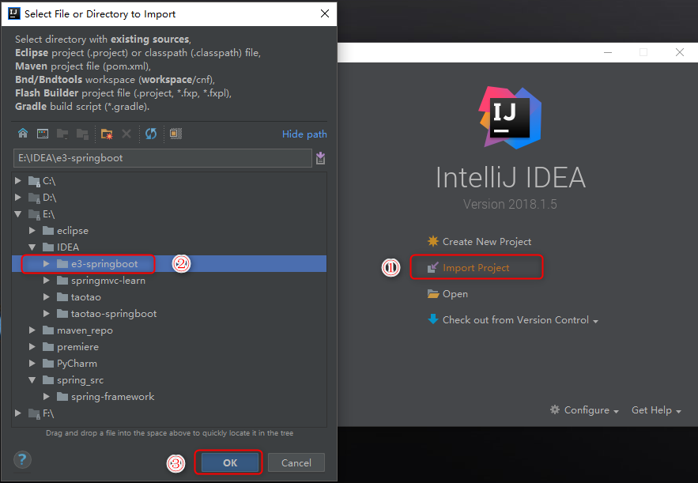

2. 选择Maven进行导入；

   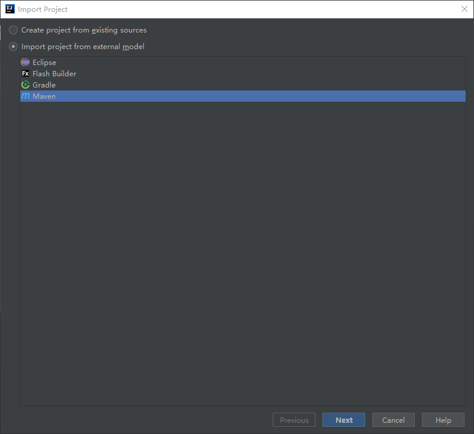

3. 利用Maven导入项目前进行相关配置；

   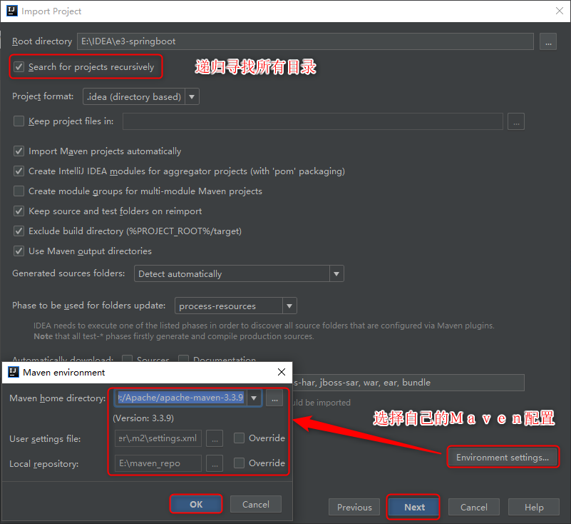

4. 然后选中所有模块进行导入即可，导入成功后可以浏览 Maven Projects 视图。

   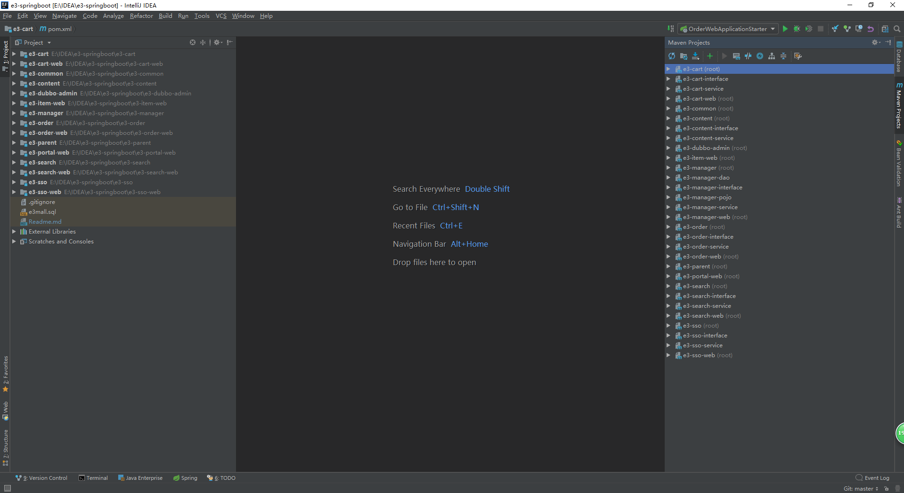

### 搭建运行环境

1. CentOS系统下安装 Docker；
2. 利用 Docker 安装MySQL、ZooKeeper、FastDFS、Redis、Solr 和 ActiveMQ。

注：具体参考[II. 项目教程](https://github.com/MrSorrow/e3-springboot#ii-项目教程)部分。

### 修改配置文件

1. 修改项目所有的 *ip* 地址；
2. 修改数据库连接用户名、密码。

### 启动所有模块

1. 启动所有容器实例；

   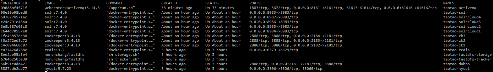

2. 启动所有Dubbo服务；

   | 服务                                                     | 模块     |
   | :------------------------------------------------------- | :------- |
   | guo.ping.e3mall.manager.ManagerServiceApplicationStarter | 后台     |
   | guo.ping.e3mall.content.ContentServiceApplicationStarter | CMS      |
   | guo.ping.e3mall.search.SearchServiceApplicationStarter   | 搜索     |
   | guo.ping.e3mall.sso.SsoServiceApplicationStarter         | 单点登录 |
   | guo.ping.e3mall.cart.CartServiceApplicationStarter       | 购物车   |
   | guo.ping.e3mall.order.OrderServiceApplicationStarter     | 订单     |

3. 启动所有Web应用。

   | Web                                                  | 模块      | 地址                                             |
   | ---------------------------------------------------- | --------- | ------------------------------------------------ |
   | guo.ping.e3mall.manager.ManagerWebApplicationStarter | 后台      | [http://localhost:8081/](http://localhost:8081/) |
   | guo.ping.e3mall.portal.PortalWebApplicationStarter   | 首页      | [http://localhost:8082/](http://localhost:8082/) |
   | guo.ping.e3mall.search.SearchWebApplicationStarter   | 搜索      | [http://localhost:8083/](http://localhost:8083/) |
   | guo.ping.e3mall.item.ItemWebApplicationStarter       | 商品详情  | [http://localhost:8084/](http://localhost:8084/) |
   | guo.ping.e3mall.sso.SsoWebApplicationStarter         | 单点登录  | [http://localhost:8085/](http://localhost:8085/) |
   | guo.ping.e3mall.cart.CartWebApplicationStarter       | 购物车    | [http://localhost:8086/](http://localhost:8086/) |
   | guo.ping.e3mall.order.OrderWebApplicationStarter     | 订单      | [http://localhost:8087/](http://localhost:8087/) |
   | com.alibaba.dubboadmin.DubboAdminApplication         | Dubbo监控 | [http://localhost:7006/](http://localhost:7006/) |

## II. 项目教程

### 搭建工程

1. Intellj IDEA创建空项目(New Project) ***e3-springboot***；

2. 创建其他模块(New Module)；

   | 模块名               | 打包方式 |
   | :------------------- | :------- |
   | e3-parent            | pom      |
   | e3-common            | jar      |
   | e3-manager           | pom      |
   | e3-manager-pojo      | jar      |
   | e3-manager-dao       | jar      |
   | e3-manager-interface | jar      |
   | e3-manager-service   | jar      |
   | e3-manager-web       | jar      |

   除 *e3-parent* 外其他所有模块父工程都为 *e3-parent，* *e3-parent* 的父工程为 *spring-boot-starter-parent*。由于使用spring boot框架，web模块打包方式也为jar。

   注：后面引入Dubbo时会进行变动。

3. *e3-manager-web* 模块的maven插件配置利用：

   ```xml
   <plugins>
       <plugin>
           <groupId>org.springframework.boot</groupId>
           <artifactId>spring-boot-maven-plugin</artifactId>
       </plugin>
   </plugins>
   ```

   其他模块的maven插件配置利用：

   ```xml
   <plugins>
       <!-- 资源文件拷贝插件 -->
       <plugin>
           <groupId>org.apache.maven.plugins</groupId>
           <artifactId>maven-resources-plugin</artifactId>
           <version>2.7</version>
           <configuration>
               <encoding>UTF-8</encoding>
           </configuration>
       </plugin>
       <!-- java编译插件 -->
       <plugin>
           <groupId>org.apache.maven.plugins</groupId>
           <artifactId>maven-compiler-plugin</artifactId>
           <version>3.2</version>
           <configuration>
               <source>1.7</source>
               <target>1.7</target>
               <encoding>UTF-8</encoding>
           </configuration>
       </plugin>
   </plugins>
   ```

### 安装MySQL

1. [CentOS 7安装Docker CE](https://docs.docker.com/install/linux/docker-ce/centos/)；

   ```bash
   # SET UP THE REPOSITORY AND INSTALL DOCKER CE
   sudo yum install -y yum-utils device-mapper-persistent-data lvm2
   sudo yum-config-manager --add-repo https://download.docker.com/linux/centos/docker-ce.repo
   sudo yum install -y docker-ce
   sudo systemctl enable docker
   sudo systemctl start docker
   # Manage Docker as a non-root user
   sudo groupadd docker
   sudo usermod -aG docker $USER
   # log out and log back in
   ```

2. [拉取MySQL镜像](https://hub.docker.com/r/library/mysql/tags/)；

   ```bash
   docker pull mysql:5.7.23
   ```

3. 启动MySQL容器（设置密码、端口映射）；

   ```bash
   docker run --name 实例名称 -p 3307:3306 -e MYSQL_ROOT_PASSWORD=密码 -d mysql:5.7.23 --character-set-server=utf8mb4 --collation-server=utf8mb4_unicode_ci
   ```

4. 开启3306端口防火墙；

   ```bash
   firewall-cmd --zone=public --add-port=3306/tcp --permanent
   firewall-cmd --reload
   ```

5. 客户端（Navicat）连接MySQL容器。

   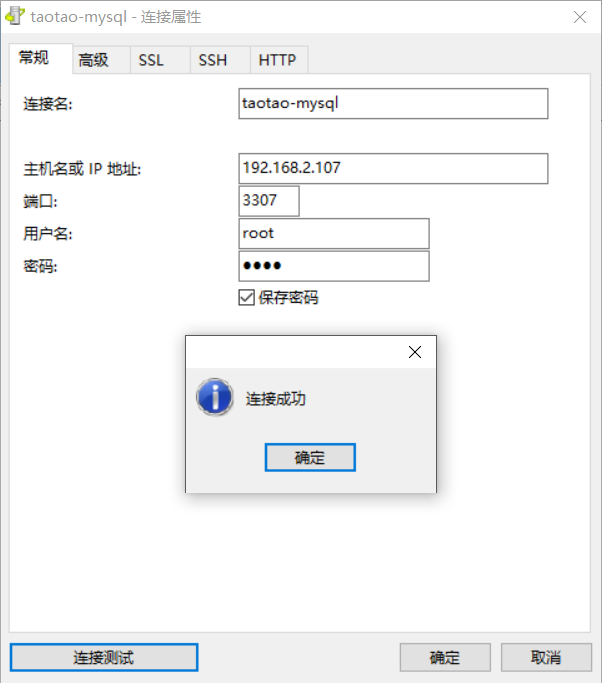

### 整合MyBatis

1. *e3-parent* 定义相关依赖；

   ```xml
   <!-- Mybatis -->
   <dependency>
       <groupId>org.mybatis.spring.boot</groupId>
       <artifactId>mybatis-spring-boot-starter</artifactId>
       <version>${mybatis.spring.boot.starter.version}</version>
   </dependency>
   <dependency>
       <groupId>com.github.miemiedev</groupId>
       <artifactId>mybatis-paginator</artifactId>
       <version>${mybatis.paginator.version}</version>
   </dependency>
   <dependency>
       <groupId>com.github.pagehelper</groupId>
       <artifactId>pagehelper</artifactId>
       <version>${pagehelper.version}</version>
   </dependency>
   <!-- MySql -->
   <dependency>
       <groupId>mysql</groupId>
       <artifactId>mysql-connector-java</artifactId>
       <version>${mysql.version}</version>
   </dependency>
   <!-- 连接池 -->
   <dependency>
       <groupId>com.alibaba</groupId>
       <artifactId>druid</artifactId>
       <version>${druid.version}</version>
   </dependency>
   ```

2. *e3-manager-dao* 导入与数据库相关依赖；

3. 在 *e3-manager-web* 的 `application.yaml` 配置数据库连接信息，以及Druid连接池；

   ```yaml
   spring:
     datasource:
       username: root
       password: 1234
       url: jdbc:mysql://192.168.2.107:3307/e3mall
       driver-class-name: com.mysql.jdbc.Driver
       type: com.alibaba.druid.pool.DruidDataSource
   ```

### 工程测试

1. 将所有mapper接口和xml文件拷贝至 *e3-manager-dao* 工程下；

   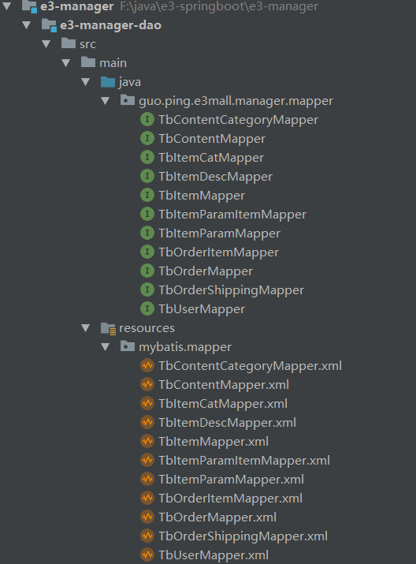

2. 在 *e3-manager-web* 下 `resource/mybatis `文件夹中创建 `SqlMapConfig.xml` 配置文件；

   ```xml
   <?xml version="1.0" encoding="UTF-8" ?>
   <!DOCTYPE configuration
           PUBLIC "-//mybatis.org//DTD Config 3.0//EN"
           "http://mybatis.org/dtd/mybatis-3-config.dtd">
   <configuration>
       <plugins>
           <!-- com.github.pagehelper为PageHelper类所在包名 -->
           <plugin interceptor="com.github.pagehelper.PageHelper">
               <!-- 设置数据库类型 Oracle,Mysql,MariaDB,SQLite,Hsqldb,PostgreSQL六种数据库-->
               <property name="dialect" value="mysql"/>
           </plugin>
       </plugins>
   </configuration>
   ```

3. 在 `application.yaml` 中配置mapper文件以及 `SqlMapConfig.xml` 所在路径。

   ```yaml
   mybatis:
     config-location: classpath:mybatis/SqlMapConfig.xml
     mapper-locations: classpath:mybatis/mapper/*.xml
   ```

4. 分别在 *e3-manager-interface*、*e3-manager-service*、*e3-manager-web* 中创建对应的 `TbItemService`、`TbItemServiceImpl`、`TbItemController` 文件，具体查看项目源码。

### 引入Dubbo

1. 整改 *e3-manager-web*，修改其 parent 为 *e3-parent*，使得其与 *e3-manager* 同级，将service层依赖修改为依赖 *e3-manager-interface*；

   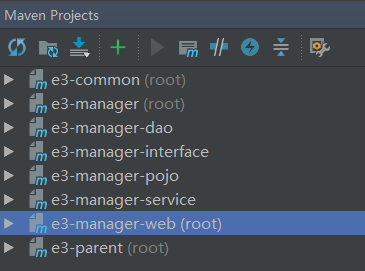

2. [拉取ZooKeeper镜像](https://hub.docker.com/_/zookeeper/)；

   ```bash
   docker pull zookeeper:3.4.13
   ```

3. 启动ZooKeeper实例用于Dubbo的注册中心；

   ```bash
   docker run --name 容器名称 -p 2181:2181 --restart always -d zookeeper:3.4.13
   ```

4. **服务发布者** *e3-manager-service* 导入相关依赖：[dubbo-spring-boot](https://github.com/apache/incubator-dubbo-spring-boot-project) [zkclient](http://mvnrepository.com/artifact/com.github.sgroschupf/zkclient/0.1)；

   ```xml
   <!--dubbo-->
   <dependency>
       <groupId>com.alibaba.boot</groupId>
       <artifactId>dubbo-spring-boot-starter</artifactId>
   </dependency>
   <!--zkclient-->
   <dependency>
       <groupId>com.github.sgroschupf</groupId>
       <artifactId>zkclient</artifactId>
       <exclusions>
           <exclusion>
               <artifactId>log4j</artifactId>
               <groupId>log4j</groupId>
           </exclusion>
       </exclusions>
   </dependency>
   ```

5. 配置Dubbo的扫描包和注册中心地址（<mark>由于官方bug扫描包配置是basePackages，而非base-packages</mark>）；

   ```yaml
   dubbo:
     application:
       name: e3-manager-service
     registry:
       address: zookeeper://192.168.2.107:2181
     scan:
       basePackages: guo.ping.e3mall.manager.service.impl
   ```

6. 利用Dubbo的 `@Service` 注解发布服务；

   ```java
   package guo.ping.e3mall.manager.service.impl;
   
   import com.alibaba.dubbo.config.annotation.Service;
   import guo.ping.e3mall.manager.mapper.TbItemMapper;
   import guo.ping.e3mall.manager.service.TbItemService;
   import guo.ping.e3mall.pojo.TbItem;
   import org.springframework.beans.factory.annotation.Autowired;
   
   @Service
   public class TbItemServiceImpl implements TbItemService {
   
       @Autowired
       private TbItemMapper tbItemMapper;
   
       @Override
       public TbItem getItemById(Long itemId) {
           return tbItemMapper.selectByPrimaryKey(itemId);
       }
   }
   ```

7. **服务消费者** *e3-manager-web* 同样引入相关依赖（同服务发布者依赖）；

8. 配置Dubbo注册中心地址；

   ```yaml
   dubbo:
     application:
       name: e3-manager-web
     registry:
         address: zookeeper://192.168.2.107:2181
   ```

9. 利用 `@Reference` 引用服务。

   ```java
   package guo.ping.e3mall.manager.controller;
   
   import com.alibaba.dubbo.config.annotation.Reference;
   import guo.ping.e3mall.manager.service.TbItemService;
   import guo.ping.e3mall.pojo.TbItem;
   import org.springframework.stereotype.Controller;
   import org.springframework.web.bind.annotation.GetMapping;
   import org.springframework.web.bind.annotation.PathVariable;
   import org.springframework.web.bind.annotation.RequestMapping;
   import org.springframework.web.bind.annotation.ResponseBody;
   
   @Controller
   @RequestMapping("/item")
   public class TbItemController {
   
       @Reference
       private TbItemService tbItemService;
   
       @GetMapping("/{itemId}")
       @ResponseBody
       public TbItem hello(@PathVariable Long itemId) {
           return tbItemService.getItemById(itemId);
       }
   }
   ```

10. 将 *e3-manager-pojo* 中的实体类实现序列化接口，便于Dubbo进行二进制传输。

### Dubbo监控中心

1. 下载dubbo-admin工程 [incubator-dubbo-ops](https://github.com/apache/incubator-dubbo-ops)；

2. 主要需要的是其中的 *dubbo-admin* 模块，将其引入我们的项目。创建 *e3-dubbo-admin* 模块，依赖 *e3-parent*  模块，将 *dubbo-admin* 相关源码、资源拷贝至 *e3-dubbo-admin* 中；

3. 修改 `resource` 下的 `application.properties` 配置文件，修改 zookeeper 注册中心地址；

   ```properties
   dubbo.registry.address=zookeeper://192.168.2.107:2181
   ```

4. 运行模块（可能会报错关于 `toString` 方法，自己重写即可）。

### 图片服务器

1. 了解[Nginx](https://blog.csdn.net/bskfnvjtlyzmv867/article/details/80682470)与[FastDFS](https://blog.csdn.net/bskfnvjtlyzmv867/article/details/80714435)；

2. [拉取FastDFS镜像](https://hub.docker.com/r/morunchang/fastdfs/)；

   ```bash
   docker pull morunchang/fastdfs
   ```

3. 运行tracker实例；

   ```bash
   docker run -d --name taotao-fastdfs-tracker --net=host morunchang/fastdfs sh tracker.sh
   ```

4. 运行storage实例；

   ```bash
   # docker run -d --name storage --net=host -e TRACKER_IP=<your tracker server address>:22122 -e GROUP_NAME=<group name> morunchang/fastdfs sh storage.sh
   docker run -d --name taotao-fastdfs-storage --net=host -e TRACKER_IP=192.168.2.107:22122 -e GROUP_NAME=group1 morunchang/fastdfs sh storage.sh
   ```

5. 修改nginx的配置，不拦截上传内容；

   ```bash
   # 1. 进入容器
   docker exec -it taotao-fastdfs-storage  /bin/bash
   # 2. 编辑nginx配置文件
   vi /data/nginx/conf/nginx.conf
   # 3. 修改以下内容
   location /group1/M00 {
        proxy_next_upstream http_502 http_504 error timeout invalid_header;
        proxy_cache http-cache;
        proxy_cache_valid  200 304 12h;
        proxy_cache_key $uri$is_args$args;
        proxy_pass http://fdfs_group1;
        expires 30d;
    }
    # 4. 退出
    exit
    # 5. 重启storage容器
    docker restart taotao-fastdfs-storage
   ```

   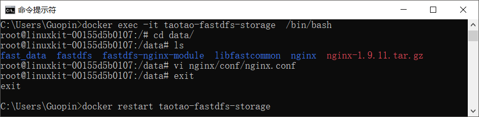

6. 开启防火墙 80、8080、22122、23000四个端口；

   ```bash
   firewall-cmd --zone=public --add-port=80/tcp --permanent
   firewall-cmd --zone=public --add-port=8080/tcp --permanent
   firewall-cmd --zone=public --add-port=22122/tcp --permanent
   firewall-cmd --zone=public --add-port=23000/tcp --permanent
   firewall-cmd --reload
   ```

7. 测试图片上传（创建配置文件、添加上传工具类 `FastDFSClient.java` 和测试类 `FastDFSTest.java`）。

   ```java
   @RunWith(SpringRunner.class)
   @SpringBootTest
   public class FastDFSTest {
       @Test
       public void testFastDfsClient() throws Exception {
           FastDFSClient fastDFSClient = new FastDFSClient("F:\\java\\e3-springboot\\e3-manager\\e3-manager-web\\src\\main\\resources\\conf\\fastdfs-client.conf");
           String file = fastDFSClient.uploadFile("C:\\Users\\Guopin\\Pictures\\Screenpresso\\2018-05-17_16h21_07.png");
           System.out.println(file);
       }
   }
   ```

   

### 安装Redis

[了解 Redis 相关基础知识](https://blog.csdn.net/bskfnvjtlyzmv867/article/details/80834857)；

**安装单机版Redis**

1. [拉取Redis镜像](https://hub.docker.com/_/redis/)；

   ```bash
   docker pull redis:3.2
   ```

2. 启动Redis容器；

   ```bash
   docker run -d -p 6379:6379 --name taotao-redis redis:3.2
   ```

3. 开启6379端口；

4. 测试连接。

   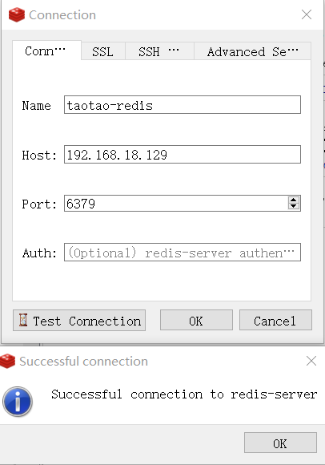

**安装集群版Redis**（一主两备）

1. [了解Docker容器 ***--link*** 参数的意义](https://www.jianshu.com/p/21d66ca6115e)；

2. 本地下载对应版本的redis压缩包（我是3.2的镜像），解压出 *redis.conf* 模板文件，拷贝三份 `redis-master.conf`、`redis-slave1.conf` 和 `redis-slave2.conf` 进行修改；

   ```properties
   # redis-master.conf 需要修改部分
   daemonize yes
   pidfile /var/run/redis.pid
   bind 0.0.0.0 # 原来是bind 127.0.0.1
   # redis-slave1.conf 需要修改部分
   daemonize yes
   pidfile /var/run/redis.pid
   slaveof master 6379 # 注释打开
   # redis-slave2.conf 需要修改部分
   daemonize yes
   pidfile /var/run/redis.pid
   slaveof master 6379 # 注释打开
   ```

   其中，`slaveof master 6379` 默认被注释，需要我们打开注释修改，master在这里充当 *ip* 的角色，后面利用 *--link* 参数来配置redis主机的别名为 *master*，用以让从机进行识别。

3. 创建redis集群容器，一主两备，备份机通过 *--link* 连接主机；

   ```bash
   docker run -it -p 6380:6379 -v /usr/local/redis/redis-master.conf:/usr/local/etc/redis/redis.conf --name taotao-rediscluster-master redis:3.2 /bin/bash
   docker run -it -p 6381:6379 -v /usr/local/redis/redis-slave1.conf:/usr/local/etc/redis/redis.conf --name taotao-rediscluster-slave1 --link taotao-rediscluster-master:master redis:3.2 /bin/bash
   docker run -it -p 6382:6379 -v /usr/local/redis/redis-slave2.conf:/usr/local/etc/redis/redis.conf --name taotao-rediscluster-slave2 --link taotao-rediscluster-master:master redis:3.2 /bin/bash
   ```

   其中，`/usr/local/redis` 目录是我在宿主机存放三个配置文件的目录，启动好一个容器可以 `Ctrl+P` 和 `Ctrl+Q` 进行退出创建下一个容器。

4. 启动redis服务。先启动 `master` ，然后启动 `slaver` 。在三个容器中都输入：

   ```bash
   redis-server /usr/local/etc/redis/redis.conf
   ```

5. 测试集群搭建情况。

   ```bash
   redis-cli
   127.0.0.1:6379> info
   ```

   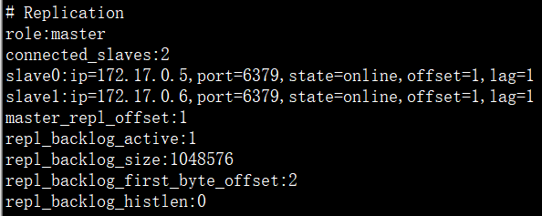

### Solr检索

[了解 Solr 服务相关基础知识](https://blog.csdn.net/bskfnvjtlyzmv867/article/details/80940089)

**安装单机版Solr**

1. [拉取 *Solr* 镜像](https://hub.docker.com/_/solr/)；

   ```bash
   docker pull solr:7.4.0
   ```

2. 启动 *Solr* 容器，即可访问 http://ip:8983/ ；

   ```bash
   docker run --name taotao-solr -d -p 8983:8983 -t solr:7.4.0
   ```

3. 新建 SolrCore，名称为 *collection1*；

   ```bash
   docker exec -it --user=solr taotao-solr bin/solr create_core -c collection1
   ```

4. 为了方便后续修改配置，将容器 solr 文件拷贝本地 `/usr/local/solr/`；

   ```bash
   docker cp taotao-solr:/opt/solr/ /usr/local/ # 容器拷贝宿主机
   ```

5. 设置中文分词 *smartcn*；

   - 进入容器 `docker exec -it taotao-solr /bin/bash` ；

   - 定位Solr7自带的中文分词器 *smartcn* 的jar包位置 `/opt/solr/contrib/analysis-extras/lucene-libs`；

   - 进入创建的 *solrcore: collection1* 配置目录 `/opt/solr/server/solr/collection1/conf` ，修改 `solrconfig.xml` 添加 *smartcn* 包的 `lib` 标签；

     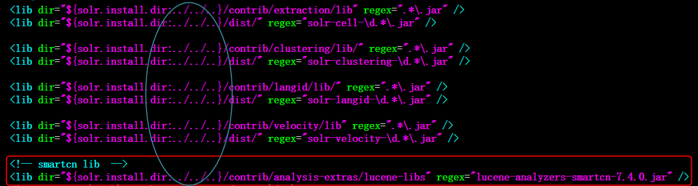

   - 在 `managed-schema` 中添加中文分词的 FieldType ；

     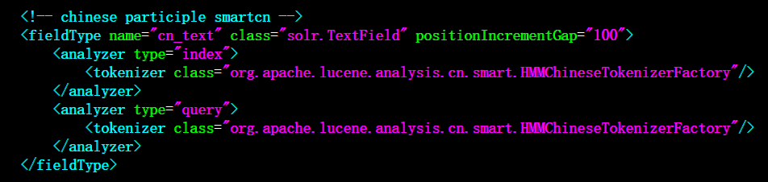

   - 上传配置，重启solr服务。

     ```bash
     docker cp /usr/local/solr/server/solr/collection1/conf/solrconfig.xml taotao-solr:/opt/solr/server/solr/collection1/conf/solrconfig.xml
     docker cp /usr/local/solr/server/solr/collection1/conf/managed-schema taotao-solr:/opt/solr/server/solr/collection1/conf/managed-schema
     docker restart taotao-solr
     ```

     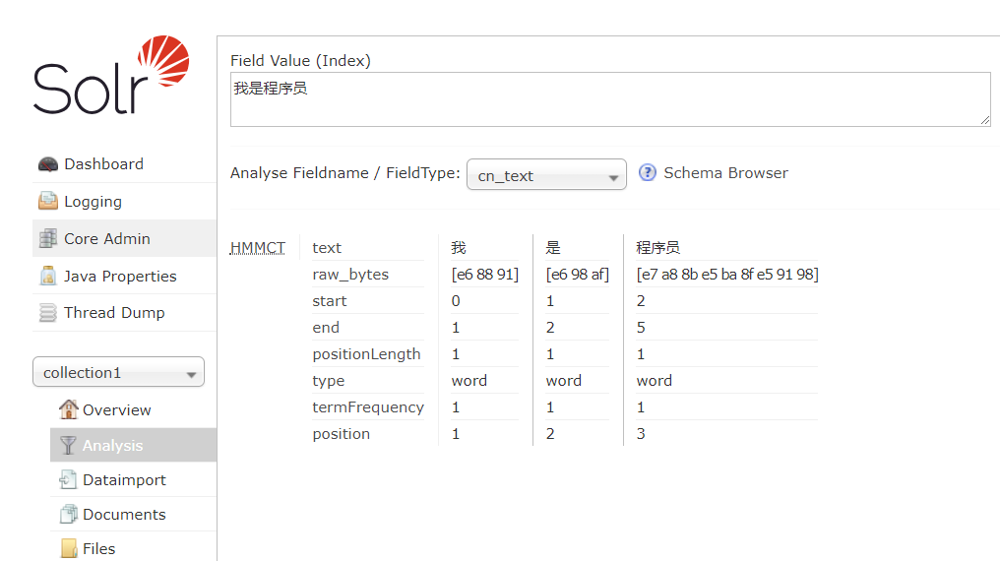


**安装集群版Solr**

1. CNM 新建 Docker 自定义网络；

   ```bash
   [root@localhost ~]# docker network create taotao-zks
   8e3f9c7f672c38573609c294c7de5c13f69dbac1f03795bf415270ca4b07c41a
   [root@localhost ~]# docker network ls
   NETWORK ID          NAME                DRIVER              SCOPE
   bdb405aa48bf        bridge              bridge              local
   52dbb516d633        host                host                local
   dd5c9b3d1fb8        none                null                local
   8e3f9c7f672c        taotao-zks          bridge              local
   ```

2. Docker 容器搭建 ZooKeeper 集群（3个实例）；

   ```bash
   # 启动实例1
   docker run -d \
        --restart=always \
        -v /usr/local/taotao-zks/zk1/data:/data \
        -v /usr/local/taotao-zks/zk1/datalog:/datalog \
        -p 2182:2181 \
        -e ZOO_MY_ID=1 \
        -e ZOO_SERVERS="server.1=taotao-zk1:2888:3888 server.2=taotao-zk2:2888:3888 server.3=taotao-zk3:2888:3888" \
        --name=taotao-zk1 \
        --net=taotao-zks \
        --privileged \
        zookeeper:3.4.13
        
   # 启动实例2
   docker run -d \
        --restart=always \
        -v /usr/local/taotao-zks/zk2/data:/data \
        -v /usr/local/taotao-zks/zk2/datalog:/datalog \
        -p 2183:2181 \
        -e ZOO_MY_ID=2 \
        -e ZOO_SERVERS="server.1=taotao-zk1:2888:3888 server.2=taotao-zk2:2888:3888 server.3=taotao-zk3:2888:3888" \
        --name=taotao-zk2 \
        --net=taotao-zks \
        --privileged \
        zookeeper:3.4.13
        
   # 启动实例3
   docker run -d \
        --restart=always \
        -v /usr/local/taotao-zks/zk3/data:/data \
        -v /usr/local/taotao-zks/zk3/datalog:/datalog \
        -p 2184:2181 \
        -e ZOO_MY_ID=3 \
        -e ZOO_SERVERS="server.1=taotao-zk1:2888:3888 server.2=taotao-zk2:2888:3888 server.3=taotao-zk3:2888:3888" \
        --name=taotao-zk3 \
        --net=taotao-zks \
        --privileged \
        zookeeper:3.4.13
   ```

3. 查看ZooKeeper集群搭建状态。

   ```bash
   # 宿主机执行命令 可能需要先安装nc(yum -y install nc)
   echo stat|nc 127.0.0.1 2182
   echo stat|nc 127.0.0.1 2183
   echo stat|nc 127.0.0.1 2184
   ```

4. 搭建 Solr Cloud（4个实例）；

   ```bash
   # 启动实例1
   docker run --name taotao-solrcloud1 --net=taotao-zks -d -p 8984:8983 solr:7.4.0 bash -c '/opt/solr/bin/solr start -f -z taotao-zk1:2181,taotao-zk2:2181,taotao-zk3:2181'
   
   # 启动实例2
   docker run --name taotao-solrcloud2 --net=taotao-zks -d -p 8985:8983 solr:7.4.0 bash -c '/opt/solr/bin/solr start -f -z taotao-zk1:2181,taotao-zk2:2181,taotao-zk3:2181'
   
   # 启动实例3
   docker run --name taotao-solrcloud3 --net=taotao-zks -d -p 8986:8983 solr:7.4.0 bash -c '/opt/solr/bin/solr start -f -z taotao-zk1:2181,taotao-zk2:2181,taotao-zk3:2181'
   
   # 启动实例4
   docker run --name taotao-solrcloud4 --net=taotao-zks -d -p 8987:8983 solr:7.4.0 bash -c '/opt/solr/bin/solr start -f -z taotao-zk1:2181,taotao-zk2:2181,taotao-zk3:2181'
   ```

5. 验证搭建结果，访问 http://ip:8984/ 、http://ip:8985/ 、http://ip:8986/ 或 http://ip:8987/；

   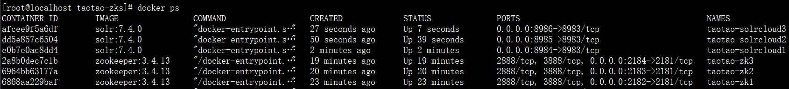

6. 上传配置文件 conf 到 ZooKeeper 中心；

   ```bash
   docker exec -it taotao-solrcloud1 /opt/solr/server/scripts/cloud-scripts/zkcli.sh -zkhost taotao-zk1:2181,taotao-zk2:2181,taotao-zk3:2181 -cmd upconfig -confdir /opt/solr/server/solr/configsets/sample_techproducts_configs/conf -confname taotao-solrcloud-conf
   ```

7. 查询zookeeper集群是否包含配置文件；

   ```bash
   docker exec -it taotao-zk1 /bin/bash
   bash-4.4# ./bin/zkCli.sh -server taotao-zk2:2181
   Connecting to taotao-zk2:2181
   ---日志省略---
   [zk: taotao-zk2:2181(CONNECTED) 0] ls /configs/taotao-solrcloud-conf
   [currency.xml, mapping-FoldToASCII.txt, managed-schema, protwords.txt, synonyms.txt, stopwords.txt, _schema_analysis_synonyms_english.json, velocity, update-script.js, _schema_analysis_stopwords_english.json, solrconfig.xml, elevate.xml, clustering, _rest_managed.json, mapping-ISOLatin1Accent.txt, spellings.txt, xslt, lang, params.json]
   ```

   请求：[http://192.168.18.129:8987/solr/admin/configs?action=LIST](http://192.168.18.129:8987/solr/admin/configs?action=LIST)

8. 更新配置文件；

   ```bash
   # 拷贝宿主机修改的目录上传至solr集群中某一节点
   docker cp /usr/local/solr/server/solr/collection1/conf/solrconfig.xml taotao-solrcloud1:/opt/solr/server/solr/configsets/sample_techproducts_configs/conf/solrconfig.xml
   docker cp /usr/local/solr/server/solr/collection1/conf/managed-schema taotao-solrcloud1:/opt/solr/server/solr/configsets/sample_techproducts_configs/conf/managed-schema
   
   # 利用putfile命令更新集群的配置文件
   docker exec -it taotao-solrcloud1 /opt/solr/server/scripts/cloud-scripts/zkcli.sh -zkhost taotao-zk1:2181,taotao-zk2:2181,taotao-zk3:2181 -cmd putfile /configs/taotao-solrcloud-conf/solrconfig.xml /opt/solr/server/solr/configsets/sample_techproducts_configs/conf/solrconfig.xml
   docker exec -it taotao-solrcloud1 /opt/solr/server/scripts/cloud-scripts/zkcli.sh -zkhost taotao-zk1:2181,taotao-zk2:2181,taotao-zk3:2181 -cmd putfile /configs/taotao-solrcloud-conf/managed-schema /opt/solr/server/solr/configsets/sample_techproducts_configs/conf/managed-schema
   ```

9. 创建collection，分两片，每片一主一备。浏览器输入请求：

   - [http://192.168.18.129:8987/solr/admin/collections?action=CREATE&name=collection1&numShards=2&replicationFactor=2 ](http://192.168.18.129:8987/solr/admin/collections?action=CREATE&name=collection1&numShards=2&replicationFactor=2)
   - [http://192.168.18.129:8987/solr/admin/collections?action=CREATE&name=collection2&numShards=2&replicationFactor=2&collection.configName=taotao-solrcloud-conf ](http://192.168.18.129:8987/solr/admin/collections?action=CREATE&name=collection2&numShards=2&replicationFactor=2&collection.configName=taotao-solrcloud-conf)

   

10. 重新载入ZooKeeper更新后的配置文件。

    [http://192.168.18.129:8987/solr/admin/collections?action=RELOAD&name=collection1](http://192.168.18.129:8987/solr/admin/collections?action=RELOAD&name=collection1)

    [http://192.168.18.129:8987/solr/admin/collections?action=RELOAD&name=collection2](http://192.168.18.129:8987/solr/admin/collections?action=RELOAD&name=collection2)

### 展示首页

1. 引入Thymeleaf模板引擎依赖；

   ```xml
   <dependency>
       <groupId>org.springframework.boot</groupId>
       <artifactId>spring-boot-starter-thymeleaf</artifactId>
   </dependency>
   ```

2. 修改 `index.jsp` 为 `index.html`, 使用 Thymeleaf 标签改写相关内容；

3. 默认Spring Boot给Spring MVC配置了欢迎页为 `template` 下的 `index.html`，需要额外扩展配置请求路径为 `/index` 、`/index.html` 时也展示首页。

   ```java
   @Configuration
   public class MySpringMvcConfig implements WebMvcConfigurer {
   
       // WebMvcConfigurerAdapter在SpringBoot 2.x过时，不过还可以用
       // 然而推荐的WebMvcConfigurationSupport 自动配置全部不再生效
   
       @Override
       public void addViewControllers(ViewControllerRegistry registry) {
           registry.addViewController("/index").setViewName("index");
           registry.addViewController("/").setViewName("index");
           registry.addViewController("/index.html").setViewName("index");
       }
   }
   ```

### 后台功能

1. 修改jsp添加所有需要的页面模板；

2. 查询商品列表；

   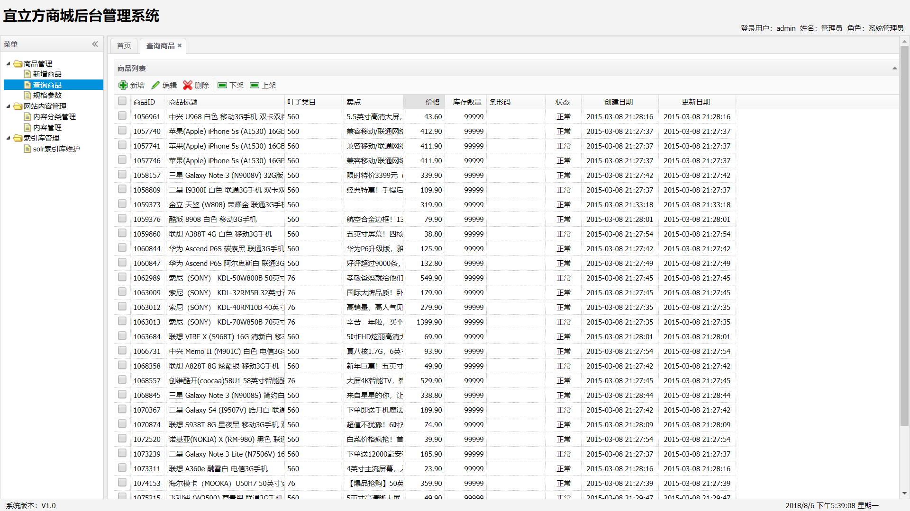

3. 新增商品选择类目（查询商品分类）；

   

4. 图片上传（Spring Boot读取自定义properties）；

5. 商品添加数据库。

### CMS系统

1. 搭建 *e3-content* 聚合工程，包含两个模块: *e3-content-interface*、*e3-content-service* (类似 *e3-manager*）;

2. 查询、新增内容分类管理功能；

3. 分类进行查询、新增内容。

   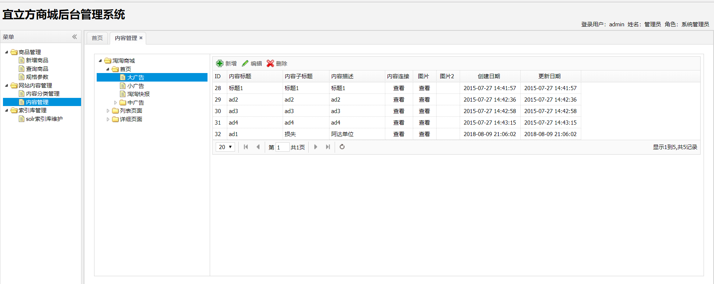

### 前台工程

1. 搭建 *e3-portal-web* 工程，类似 *e3-manager-web* ；

2. 修改前端模板页面；

3. 类似 *e3-manager-web* 中配置Springboot展示首页；

4. CMS系统新增首页轮播图内容并插入数据库；

5. 首页展示轮播图，添加redis缓存；

   

### 搜索服务

1. 搭建 *e3-search* 聚合工程，包含两个模块: *e3-search-interface*、*e3-content-service* (类似 *e3-content*）;

2. 配置业务域，修改方法类似配置中文分词器；

   ```xml
   <field name="item_title" type="cn_text" indexed="true" stored="true"/>
   <field name="item_sell_point" type="cn_text" indexed="true" stored="true"/>
   <field name="item_price"  type="plong" indexed="true" stored="true"/>
   <field name="item_image" type="string" indexed="false" stored="true" />
   <field name="item_category_name" type="string" indexed="true" stored="true" />
   
   <field name="item_keywords" type="cn_text" indexed="true" stored="false" multiValued="true"/>
   <copyField source="item_title" dest="item_keywords"/>
   <copyField source="item_sell_point" dest="item_keywords"/>
   <copyField source="item_category_name" dest="item_keywords"/>
   ```

3. 编写查询数据库商品信息的mapper接口实现；

   ```xml
   <?xml version="1.0" encoding="UTF-8" ?>
   <!DOCTYPE mapper PUBLIC "-//mybatis.org//DTD Mapper 3.0//EN" "http://mybatis.org/dtd/mybatis-3-mapper.dtd" >
   <mapper namespace="guo.ping.e3mall.search.mapper.SearchItemMapper" >
       <select id="getItemList" resultType="guo.ping.e3mall.common.pojo.SearchItem">
           SELECT
           a.id,
           a.title,
           a.sell_point,
           a.price,
           a.image,
           b.`name` category_name
           FROM
           `tb_item` a
           LEFT JOIN tb_item_cat b ON a.cid = b.id
           WHERE a.`status`=1
       </select>
   </mapper>
   ```

4. Maven导入 `spring-boot-starter-data-solr` ，`application.yaml` 配置 solr；

   ```yaml
   spring:
     data:
       solr:
         host: http://192.168.18.129:9080/solr/collection1
   ```

5. *e3-content-service* 进行发布服务，*e3-manager-web* 进行调用。

   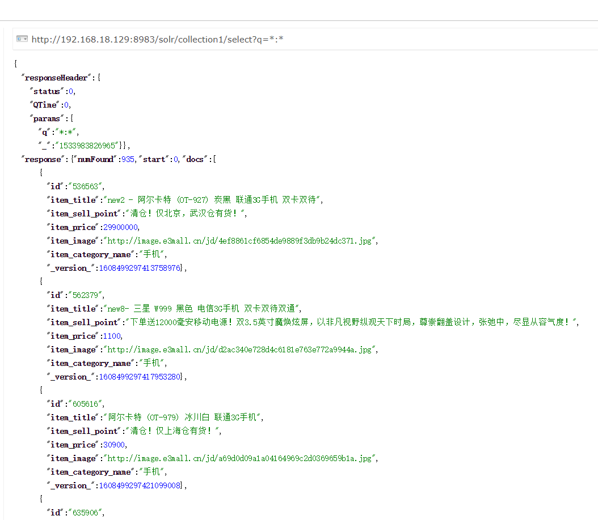

### 搜索前端

1. 创建 *e3-search-web* 工程，类似 *e3-portal-web*；

2. 利用 SolrJ 进行检索，发布搜索服务；

3. *e3-search-web* 调用服务，前端进行搜索。

   

### ActiveMQ

1. [拉取 ActiveMQ 镜像](https://hub.docker.com/r/webcenter/activemq/)；

   ```bash
   docker pull webcenter/activemq:5.14.3
   ```

2. 启动容器实例；

   ```bash
   docker run -d --name taotao-activemq -p 61616:61616 -p 8161:8161 webcenter/activemq:5.14.3
   ```

3. 宿主机开启防火墙端口8161和61616；

4. 访问 [http://ip:8161](http://ip:8161) 进入管理页面，默认登录账户密码均为 *admin*；

5. 商品添加服务 *e3-manager-service* 和搜索服务模块 *e3-search-service* 引入 ActiveMQ；

   ```xml
   <dependency>
       <groupId>org.springframework.boot</groupId>
       <artifactId>spring-boot-starter-activemq</artifactId>
   </dependency>
   <!--  启用JMS 的池化-->
   <dependency>
       <groupId>org.apache.activemq</groupId>
       <artifactId>activemq-pool</artifactId>
   </dependency>
   ```

6. 添加 ActiveMQ 配置文件；

   ```yaml
   spring:
     activemq:
       user: admin
       password: admin
       broker-url: tcp://192.168.18.129:61616
       pool:
         enabled: true
         max-connections: 50
       packages:
         trust-all: false
   ```

7. 商品添加完成时发送 *Topic* 消息；

   ```java
   @Service
   public class TbItemServiceImpl implements TbItemService {
       
       ...
   
       @Autowired
       private JmsMessagingTemplate jmsMessagingTemplate;
   
       /**
        * 后台管理添加商品至数据库
        */
       @Override
       public E3Result addItem(TbItem item, String desc) {
           // 向商品描述表插入数据
           ...
           tbItemDescMapper.insert(item);
           // 发送消息队列，通知新增商品id
           ActiveMQTopic itemAddTopic = new ActiveMQTopic("itemAddTopic");
           jmsMessagingTemplate.convertAndSend(itemAddTopic, item.getId());
           
           return E3Result.ok();
       }
   }
   ```

8. 搜索服务工程接收 *Topic* 消息。

   更改监听配置，自定义监听工厂（包含 *Queue* 和 *Topic* ）：

   ```java
   package guo.ping.e3mall.search.config;
   
   import org.springframework.context.annotation.Bean;
   import org.springframework.context.annotation.Configuration;
   import org.springframework.jms.annotation.EnableJms;
   import org.springframework.jms.config.DefaultJmsListenerContainerFactory;
   import org.springframework.jms.config.JmsListenerContainerFactory;
   
   import javax.jms.ConnectionFactory;
   
   @Configuration
   @EnableJms
   public class MyJmsConfig {
   
       @Bean("jmsQueueListenerContainerFactory")
       public JmsListenerContainerFactory jmsQueueListenerContainerFactory(ConnectionFactory connectionFactory) {
           DefaultJmsListenerContainerFactory factory =
                   new DefaultJmsListenerContainerFactory();
           factory.setConnectionFactory(connectionFactory);
           //设置连接数
           factory.setConcurrency("3-10");
           //重连间隔时间
           factory.setRecoveryInterval(1000L);
           factory.setPubSubDomain(false);
           return factory;
   
       }
   
       @Bean("jmsTopicListenerContainerFactory")
       public JmsListenerContainerFactory jmsTopicListenerContainerFactory(ConnectionFactory connectionFactory) {
           DefaultJmsListenerContainerFactory factory =
                   new DefaultJmsListenerContainerFactory();
           factory.setConnectionFactory(connectionFactory);
           //重连间隔时间
           factory.setPubSubDomain(true);
           return factory;
   
       }
   }
   ```

   使用 `@JmsListener` 进行监听的，设置工厂为上面注入的 Topic 工厂：

   ```java
   package guo.ping.e3mall.search.message;
   
   import guo.ping.e3mall.common.pojo.SearchItem;
   import guo.ping.e3mall.search.mapper.SearchItemMapper;
   import org.apache.solr.client.solrj.SolrClient;
   import org.apache.solr.client.solrj.SolrServerException;
   import org.apache.solr.common.SolrInputDocument;
   import org.springframework.beans.factory.annotation.Autowired;
   import org.springframework.jms.annotation.JmsListener;
   import org.springframework.stereotype.Component;
   
   import java.io.IOException;
   
   @Component
   public class ItemAddMessageReceiver {
   
       @Autowired
       private SearchItemMapper searchItemMapper;
       @Autowired
       private SolrClient solrClient;
   
       @JmsListener(destination = "itemAddTopic", containerFactory = "jmsTopicListenerContainerFactory")
       public void itemAddReceiver(Long msg) {
           try {
               // 0、等待1s让e3-manager-service提交完事务，商品添加成功
               Thread.sleep(1000);
               // 1、根据商品id查询商品信息
               SearchItem searchItem = searchItemMapper.getItemById(msg);
               // 2、创建一SolrInputDocument对象。
               SolrInputDocument document = new SolrInputDocument();
               // 3、使用SolrServer对象写入索引库。
               document.addField("id", searchItem.getId());
               document.addField("item_title", searchItem.getTitle());
               document.addField("item_sell_point", searchItem.getSell_point());
               document.addField("item_price", searchItem.getPrice());
               document.addField("item_image", searchItem.getImage());
               document.addField("item_category_name", searchItem.getCategory_name());
               // 5、向索引库中添加文档。
               solrClient.add(document);
               solrClient.commit();
           } catch (SolrServerException e) {
               e.printStackTrace();
           } catch (IOException e) {
               e.printStackTrace();
           }
       }
   }
   ```

### 商品详情

1. 搭建 *e3-item-web* 模块（类似 *e3-portal-web* ）；

2. 查询商品基本信息以及详情描述；

3. 为商品信息添加 Redis 缓存，设置缓存数据有效期为1天；

4. 利用 Thymeleaf 模板展示商品详情页面。

   

### 页面静态化

1. 利用 Thymeleaf 进行商品详情页面的静态化；

2. 引入 ActiveMQ 监听添加商品消息，并生成页面；

   ```java
   /**
    * 接收后台添加商品消息，生成商品详情页面
    */
   @Component
   public class GeneratePageMessageReceiver {
   
       @Reference
       private TbItemService itemService;
       @Autowired
       private SpringTemplateEngine springTemplateEngine;
       @Value("${TEMPLATE_NAME}")
       private String TEMPLATE_NAME;
       @Value("${TEMPLATE_FILEPATH}")
       private String TEMPLATE_FILEPATH;
   
       @JmsListener(destination = "itemAddTopic", containerFactory = "jmsTopicListenerContainerFactory")
       public void itemAddReceiver(Long itemId) {
           try {
               // 0、等待1s让e3-manager-service提交完事务，商品添加成功
               Thread.sleep(1000);
               // 1、准备商品数据
               TbItem tbItem = itemService.getItemById(itemId);
               TbItemDesc itemDesc = itemService.getItemDescById(itemId);
               Item item = new Item(tbItem);
               // 2、构造上下文(Model)
               Context context = new Context();
               context.setVariable("item", item);
               context.setVariable("itemDesc", itemDesc);
               // 3、生成页面
               FileWriter writer = new FileWriter(TEMPLATE_FILEPATH + itemId + ".html");
               springTemplateEngine.process(TEMPLATE_NAME, context, writer);
           } catch (InterruptedException e) {
               e.printStackTrace();
           } catch (IOException e) {
               e.printStackTrace();
           }
       }
   }
   ```

3. 利用 Nginx 服务器，实现静态页面访问。

### 单点登录

1. 搭建 *e3-sso* 聚合工程，包含 *e3-sso-interface* 和 *e3-sso-service* 两个模块（类似 *e3-content* ）；

2. 搭建 *e3-sso-web* 前台单点登录模块（类似 *e3-portal-web* ）；

3. 用户填写的注册信息进行后台数据校验；

4. 用户登录、注册实现；

5. 利用 Redis 模拟SessionID 实现分布式系统 Session 同步共享（蓝底部分）；

   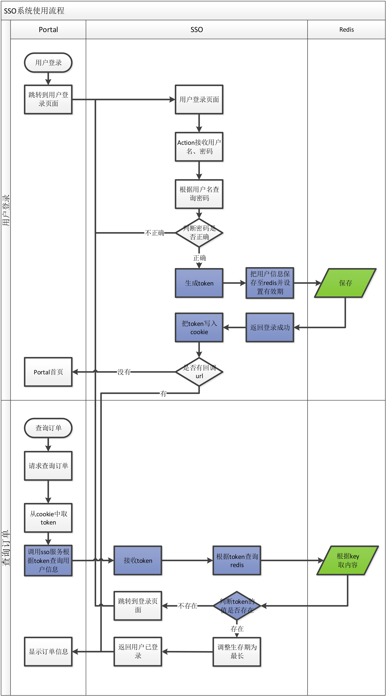

6. 其他系统调用*SSO*服务根据 token 查询用户信息（跨域请求）。

### 购物车模块

1. 搭建 *e3-cart* 聚合工程，包含 *e3-cart-interface* 和 *e3-cart-service* 两个模块（类似 *e3-sso* ）；

2. 搭建 *e3-cart-web* 前台单点登录模块（类似 *e3-sso-web* ）；

3. 用户添加商品至购物车保存至 *Cookie*；

4. 从 *Cookie* 中取出商品列表，修改时更新 *Cookie*（购物车增删改查）；

5. 登录拦截器判断用户登录状态；

6. 用户登录后，利用Redis保存用户购物车信息，并与Cookie中进行合并。

   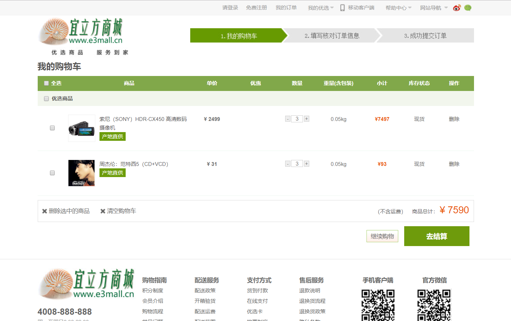

### 订单系统

1. 搭建 *e3-order* 聚合工程，包含 *e3-order-interface* 和 *e3-order-service* 两个模块；
2. 搭建 *e3-order-web* 前台订单模块；
3. 利用 Redis 生成订单号；
4. 创建订单，保存至数据库。

