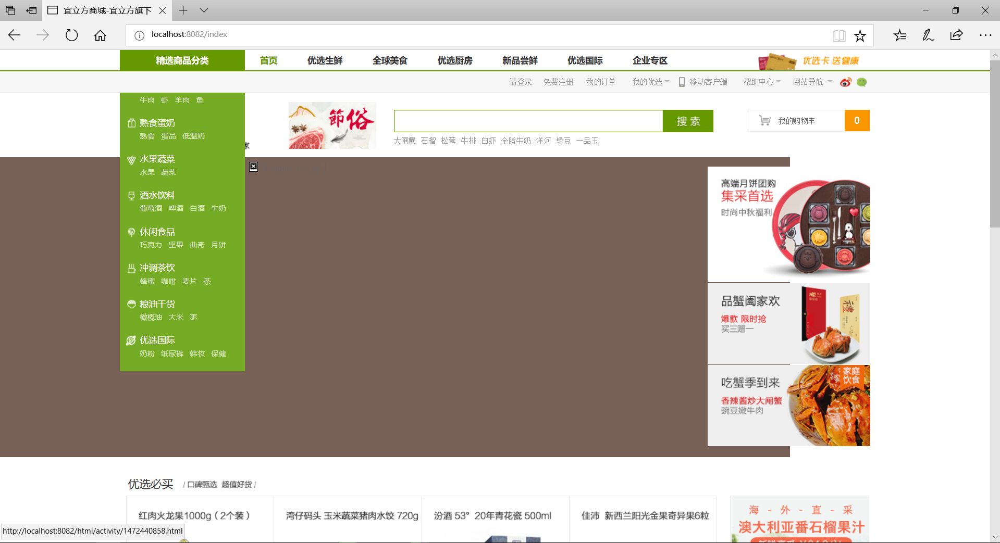

# SpringBoot+Docker重构淘淘商城

           

本项目源于某培训机构的宜立方商城（淘淘商城）项目，重新利用 `SpringBoot 2.0.4` 框架替代原始的SSM三大框架进行重构项目，采用 `Docker` 容器替代原本的虚拟机来进行项目的部署。

## I. 导入工程

## II. 项目教程

### 搭建工程

1. Intellj IDEA创建空项目(New Project) ***e3-springboot***；

2. 创建其他模块(New Module)；

   | 模块名               | 打包方式 |
   | :------------------- | :------- |
   | e3-parent            | pom      |
   | e3-common            | jar      |
   | e3-manager           | pom      |
   | e3-manager-pojo      | jar      |
   | e3-manager-dao       | jar      |
   | e3-manager-interface | jar      |
   | e3-manager-service   | jar      |
   | e3-manager-web       | jar      |

   除 *e3-parent* 外其他所有模块父工程都为 *e3-parent，* *e3-parent* 的父工程为 *spring-boot-starter-parent*。由于使用spring boot框架，web模块打包方式也为jar。

   注：后面引入Dubbo时会进行变动。

3. *e3-manager-web* 模块的maven插件配置利用：

   ```xml
   <plugins>
       <plugin>
           <groupId>org.springframework.boot</groupId>
           <artifactId>spring-boot-maven-plugin</artifactId>
       </plugin>
   </plugins>
   ```

   其他模块的maven插件配置利用：

   ```xml
   <plugins>
       <!-- 资源文件拷贝插件 -->
       <plugin>
           <groupId>org.apache.maven.plugins</groupId>
           <artifactId>maven-resources-plugin</artifactId>
           <version>2.7</version>
           <configuration>
               <encoding>UTF-8</encoding>
           </configuration>
       </plugin>
       <!-- java编译插件 -->
       <plugin>
           <groupId>org.apache.maven.plugins</groupId>
           <artifactId>maven-compiler-plugin</artifactId>
           <version>3.2</version>
           <configuration>
               <source>1.7</source>
               <target>1.7</target>
               <encoding>UTF-8</encoding>
           </configuration>
       </plugin>
   </plugins>
   ```

### 安装MySQL

1. [CentOS7安装Docker CE](https://docs.docker.com/install/linux/docker-ce/centos/)；

   ```bash
   # SET UP THE REPOSITORY AND INSTALL DOCKER CE
   sudo yum install -y yum-utils device-mapper-persistent-data lvm2
   sudo yum-config-manager --add-repo https://download.docker.com/linux/centos/docker-ce.repo
   sudo yum install -y docker-ce
   sudo systemctl enable docker
   sudo systemctl start docker
   # Manage Docker as a non-root user
   sudo groupadd docker
   sudo usermod -aG docker $USER
   ＃log out and log back in
   ```

2. [拉取MySQL镜像](https://hub.docker.com/r/library/mysql/tags/)；

   ```bash
   docker pull mysql:5.7.23
   ```

3. 启动MySQL容器（设置密码、端口映射）；

   ```bash
   docker run --name 实例名称 -p 3307:3306 -e MYSQL_ROOT_PASSWORD=密码 -d mysql:5.7.23 --character-set-server=utf8mb4 --collation-server=utf8mb4_unicode_ci
   ```

4. 开启3306端口防火墙；

   ```bash
   firewall-cmd --zone=public --add-port=3306/tcp --permanent
   firewall-cmd --reload
   ```

5. 客户端（Navicat）连接MySQL容器。

   

### 整合MyBatis

1. *e3-parent* 定义相关依赖；

   ```xml
   <!-- Mybatis -->
   <dependency>
       <groupId>org.mybatis.spring.boot</groupId>
       <artifactId>mybatis-spring-boot-starter</artifactId>
       <version>${mybatis.spring.boot.starter.version}</version>
   </dependency>
   <dependency>
       <groupId>com.github.miemiedev</groupId>
       <artifactId>mybatis-paginator</artifactId>
       <version>${mybatis.paginator.version}</version>
   </dependency>
   <dependency>
       <groupId>com.github.pagehelper</groupId>
       <artifactId>pagehelper</artifactId>
       <version>${pagehelper.version}</version>
   </dependency>
   <!-- MySql -->
   <dependency>
       <groupId>mysql</groupId>
       <artifactId>mysql-connector-java</artifactId>
       <version>${mysql.version}</version>
   </dependency>
   <!-- 连接池 -->
   <dependency>
       <groupId>com.alibaba</groupId>
       <artifactId>druid</artifactId>
       <version>${druid.version}</version>
   </dependency>
   ```

2. *e3-manager-dao* 导入与数据库相关依赖；

3. 在 *e3-manager-web* 的 `application.yaml` 配置数据库连接信息，以及Druid连接池；

   ```yaml
   spring:
     datasource:
       username: root
       password: 1234
       url: jdbc:mysql://192.168.2.107:3307/e3mall
       driver-class-name: com.mysql.jdbc.Driver
       type: com.alibaba.druid.pool.DruidDataSource
   ```

### 整合测试

1. 将所有mapper接口和xml文件拷贝至 *e3-manager-dao* 工程下；

   

2. 在 *e3-manager-web* 下 `resource/mybatis `文件夹中创建 `SqlMapConfig.xml` 配置文件；

   ```xml
   <?xml version="1.0" encoding="UTF-8" ?>
   <!DOCTYPE configuration
           PUBLIC "-//mybatis.org//DTD Config 3.0//EN"
           "http://mybatis.org/dtd/mybatis-3-config.dtd">
   <configuration>
       <plugins>
           <!-- com.github.pagehelper为PageHelper类所在包名 -->
           <plugin interceptor="com.github.pagehelper.PageHelper">
               <!-- 设置数据库类型 Oracle,Mysql,MariaDB,SQLite,Hsqldb,PostgreSQL六种数据库-->
               <property name="dialect" value="mysql"/>
           </plugin>
       </plugins>
   </configuration>
   ```

3. 在 `application.yaml` 中配置mapper文件以及 `SqlMapConfig.xml` 所在路径。

   ```yaml
   mybatis:
     config-location: classpath:mybatis/SqlMapConfig.xml
     mapper-locations: classpath:mybatis/mapper/*.xml
   ```

4. 分别在 *e3-manager-interface*、*e3-manager-service*、*e3-manager-web* 中创建对应的 `TbItemService`、`TbItemServiceImpl`、`TbItemController` 文件，具体查看项目源码。

### 引入Dubbo

1. 整改 *e3-manager-web*，修改其 parent 为 *e3-parent*，使得其与 *e3-manager* 同级，将service层依赖修改为依赖 *e3-manager-interface*；

   

2. [拉取ZooKeeper镜像](https://hub.docker.com/_/zookeeper/)；

   ```bash
   docker pull zookeeper:3.4.13
   ```

3. 启动ZooKeeper实例用于Dubbo的注册中心；

   ```bash
   docker run --name 容器名称 -p 2181:2181 --restart always -d zookeeper:3.4.13
   ```

4. **服务发布者** *e3-manager-service* 导入相关依赖：[dubbo-spring-boot](https://github.com/apache/incubator-dubbo-spring-boot-project) [zkclient](http://mvnrepository.com/artifact/com.github.sgroschupf/zkclient/0.1)；

   ```xml
   <!--dubbo-->
   <dependency>
       <groupId>com.alibaba.boot</groupId>
       <artifactId>dubbo-spring-boot-starter</artifactId>
   </dependency>
   <!--zkclient-->
   <dependency>
       <groupId>com.github.sgroschupf</groupId>
       <artifactId>zkclient</artifactId>
       <exclusions>
           <exclusion>
               <artifactId>log4j</artifactId>
               <groupId>log4j</groupId>
           </exclusion>
       </exclusions>
   </dependency>
   ```

5. 配置Dubbo的扫描包和注册中心地址（<mark>由于官方bug扫描包配置是basePackages，而非base-packages</mark>）；

   ```yaml
   dubbo:
     application:
       name: e3-manager-service
     registry:
       address: zookeeper://192.168.2.107:2181
     scan:
       basePackages: guo.ping.e3mall.manager.service.impl
   ```

6. 利用Dubbo的 `@Service` 注解发布服务；

   ```java
   package guo.ping.e3mall.manager.service.impl;
   
   import com.alibaba.dubbo.config.annotation.Service;
   import guo.ping.e3mall.manager.mapper.TbItemMapper;
   import guo.ping.e3mall.manager.service.TbItemService;
   import guo.ping.e3mall.pojo.TbItem;
   import org.springframework.beans.factory.annotation.Autowired;
   
   @Service
   public class TbItemServiceImpl implements TbItemService {
   
       @Autowired
       private TbItemMapper tbItemMapper;
   
       @Override
       public TbItem getItemById(Long itemId) {
           return tbItemMapper.selectByPrimaryKey(itemId);
       }
   }
   ```

7. **服务消费者** *e3-manager-web* 同样引入相关依赖（同服务发布者依赖）；

8. 配置Dubbo注册中心地址；

   ```yaml
   dubbo:
     application:
       name: e3-manager-web
     registry:
         address: zookeeper://192.168.2.107:2181
   ```

9. 利用 `@Reference` 引用服务。

   ```java
   package guo.ping.e3mall.manager.controller;
   
   import com.alibaba.dubbo.config.annotation.Reference;
   import guo.ping.e3mall.manager.service.TbItemService;
   import guo.ping.e3mall.pojo.TbItem;
   import org.springframework.stereotype.Controller;
   import org.springframework.web.bind.annotation.GetMapping;
   import org.springframework.web.bind.annotation.PathVariable;
   import org.springframework.web.bind.annotation.RequestMapping;
   import org.springframework.web.bind.annotation.ResponseBody;
   
   @Controller
   @RequestMapping("/item")
   public class TbItemController {
   
       @Reference
       private TbItemService tbItemService;
   
       @GetMapping("/{itemId}")
       @ResponseBody
       public TbItem hello(@PathVariable Long itemId) {
           return tbItemService.getItemById(itemId);
       }
   }
   ```

10. 将 *e3-manager-pojo* 中的实体类实现序列化接口，便于Dubbo进行二进制传输。

### Dubbo监控中心

1. 下载dubbo-admin工程 [incubator-dubbo-ops](https://github.com/apache/incubator-dubbo-ops)；

2. 主要需要的是其中的 *dubbo-admin* 模块，将其引入我们的项目。创建 *e3-dubbo-admin* 模块，依赖 *e3-parent*  模块，将 *dubbo-admin* 相关源码、资源拷贝至 *e3-dubbo-admin* 中；

3. 修改 `resource` 下的 `application.properties` 配置文件，修改 zookeeper 注册中心地址；

   ```properties
   dubbo.registry.address=zookeeper://192.168.2.107:2181
   ```

4. 运行模块（可能会报错关于 `toString` 方法，自己重写即可）。

### 图片服务器

1. 了解[Nginx](https://blog.csdn.net/bskfnvjtlyzmv867/article/details/80682470)与[FastDFS](https://blog.csdn.net/bskfnvjtlyzmv867/article/details/80714435)；

2. [拉取FastDFS镜像](https://hub.docker.com/r/morunchang/fastdfs/)；

   ```bash
   docker pull morunchang/fastdfs
   ```

3. 运行tracker实例；

   ```bash
   docker run -d --name taotao-fastdfs-tracker --net=host morunchang/fastdfs sh tracker.sh
   ```

4. 运行storage实例；

   ```bash
   # docker run -d --name storage --net=host -e TRACKER_IP=<your tracker server address>:22122 -e GROUP_NAME=<group name> morunchang/fastdfs sh storage.sh
   docker run -d --name taotao-fastdfs-storage --net=host -e TRACKER_IP=192.168.2.107:22122 -e GROUP_NAME=group1 morunchang/fastdfs sh storage.sh
   ```

5. 修改nginx的配置，不拦截上传内容；

   ```bash
   # 1. 进入容器
   docker exec -it taotao-fastdfs-storage  /bin/bash
   # 2. 编辑nginx配置文件
   vi /data/nginx/conf/nginx.conf
   # 3. 修改以下内容
   location /group1/M00 {
        proxy_next_upstream http_502 http_504 error timeout invalid_header;
        proxy_cache http-cache;
        proxy_cache_valid  200 304 12h;
        proxy_cache_key $uri$is_args$args;
        proxy_pass http://fdfs_group1;
        expires 30d;
    }
    # 4. 退出
    exit
    # 5. 重启storage容器
    docker restart taotao-fastdfs-storage
   ```

   

6. 开启防火墙 80、8080、22122、23000四个端口；

   ```bash
   firewall-cmd --zone=public --add-port=80/tcp --permanent
   firewall-cmd --zone=public --add-port=8080/tcp --permanent
   firewall-cmd --zone=public --add-port=22122/tcp --permanent
   firewall-cmd --zone=public --add-port=23000/tcp --permanent
   firewall-cmd --reload
   ```

7. 测试图片上传（创建配置文件、添加上传工具类 `FastDFSClient.java` 和测试类 `FastDFSTest.java`）。

   ```java
   @RunWith(SpringRunner.class)
   @SpringBootTest
   public class FastDFSTest {
       @Test
       public void testFastDfsClient() throws Exception {
           FastDFSClient fastDFSClient = new FastDFSClient("F:\\java\\e3-springboot\\e3-manager\\e3-manager-web\\src\\main\\resources\\conf\\fastdfs-client.conf");
           String file = fastDFSClient.uploadFile("C:\\Users\\Guopin\\Pictures\\Screenpresso\\2018-05-17_16h21_07.png");
           System.out.println(file);
       }
   }
   ```

   

### 安装Redis

**安装单机版Redis**

1. [了解 Redis 缓存](https://blog.csdn.net/bskfnvjtlyzmv867/article/details/80834857)；

2. [拉取Redis镜像](https://hub.docker.com/_/redis/)；

   ```bash
   docker pull redis:3.2
   ```

3. 启动Redis容器；

   ```bash
   docker run -d -p 6379:6379 --name taotao-redis redis:3.2
   ```

4. 开启6379端口；

5. 测试连接。

   

   **安装集群版Redis**（一主两备）

   1. [了解Docker容器 ***--link*** 参数的意义](https://www.jianshu.com/p/21d66ca6115e)；

   2. 本地下载对应版本的redis压缩包（我是3.2的镜像），解压出 *redis.conf* 模板文件，拷贝三份 `redis-master.conf`、`redis-slave1.conf` 和 `redis-slave2.conf` 进行修改；

      ```properties
      # redis-master.conf 需要修改部分
      daemonize yes
      pidfile /var/run/redis.pid
      bind 0.0.0.0 # 原来是bind 127.0.0.1
      # redis-slave1.conf 需要修改部分
      daemonize yes
      pidfile /var/run/redis.pid
      slaveof master 6379 # 注释打开
      # redis-slave2.conf 需要修改部分
      daemonize yes
      pidfile /var/run/redis.pid
      slaveof master 6379 # 注释打开
      ```

      其中，`slaveof master 6379` 默认被注释，需要我们打开注释修改，master在这里充当 *ip* 的角色，后面利用 *--link* 参数来配置redis主机的别名为 *master*，用以让从机进行识别。

   3. 创建redis集群容器，一主两备，备份机通过 *--link* 连接主机；

      ```bash
      docker run -it -p 6380:6379 -v /usr/local/redis/redis-master.conf:/usr/local/etc/redis/redis.conf --name taotao-rediscluster-master redis:3.2 /bin/bash
      docker run -it -p 6381:6379 -v /usr/local/redis/redis-slave1.conf:/usr/local/etc/redis/redis.conf --name taotao-rediscluster-slave1 --link taotao-rediscluster-master:master redis:3.2 /bin/bash
      docker run -it -p 6382:6379 -v /usr/local/redis/redis-slave2.conf:/usr/local/etc/redis/redis.conf --name taotao-rediscluster-slave2 --link taotao-rediscluster-master:master redis:3.2 /bin/bash
      ```

      其中，`/usr/local/redis` 目录是我在宿主机存放三个配置文件的目录，启动好一个容器可以 `Ctrl+P` 和 `Ctrl+Q` 进行退出创建下一个容器。

   4. 启动redis服务。先启动 `master` ，然后启动 `slaver` 。在三个容器中都输入：

      ```bash
      redis-server /usr/local/etc/redis/redis.conf
      ```

   5. 测试集群搭建情况。

      ```bash
      redis-cli
      127.0.0.1:6379> info
      ```

      

### 展示首页

1. 引入Thymeleaf模板引擎依赖；

   ```xml
   <dependency>
       <groupId>org.springframework.boot</groupId>
       <artifactId>spring-boot-starter-thymeleaf</artifactId>
   </dependency>
   ```

2. 修改 `index.jsp` 为 `index.html`, 使用 Thymeleaf 标签改写相关内容；

3. 默认Spring Boot给Spring MVC配置了欢迎页为 `template` 下的 `index.html`，需要额外扩展配置请求路径为 `/index` 、`/index.html` 时也展示首页。

   ```java
   @Configuration
   public class MySpringMvcConfig implements WebMvcConfigurer {
   
       // WebMvcConfigurerAdapter在SpringBoot 2.x过时，不过还可以用
       // 然而推荐的WebMvcConfigurationSupport 自动配置全部不再生效
   
       @Override
       public void addViewControllers(ViewControllerRegistry registry) {
           registry.addViewController("/index").setViewName("index");
           registry.addViewController("/").setViewName("index");
           registry.addViewController("/index.html").setViewName("index");
       }
   }
   ```

### 后台功能

1. 修改jsp添加所有需要的页面模板；

2. 查询商品列表；

   

3. 新增商品选择类目（查询商品分类）；

   

4. 图片上传（Spring Boot读取自定义properties）；

5. 商品添加数据库。

### CMS系统

1. 搭建 *e3-content* 聚合工程，包含两个模块: *e3-content-service*、*e3-content-web* (类似 *e3-manager*）;

2. 查询、新增内容分类管理功能；

3. 分类进行查询、新增内容。

   

### 前台工程

1. 搭建 *e3-portal-web* 工程，类似 *e3-manager-web* ；

2. 修改前端模板页面；

3. 类似 *e3-manager-web* 中配置Springboot展示首页；

   

